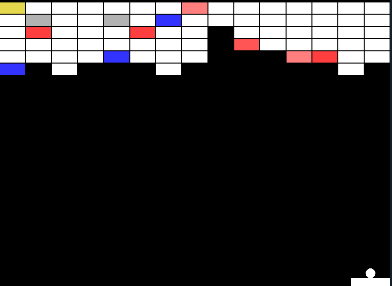

# Casse-brique basique [LÖVE2D]

Very simple break-out game made to become familiar with the [LÖVE2D](https://love2d.org/) framework and the [Lua](http://www.lua.org/) language.

Use the mouse to control the pad.

You can test the game here : https://jehadel.github.io/Casse-Brique_basic/

## Usage
<!-- TODO -->

Run the game :

        make play

Build a version to run in a browser (with [love.js](https://github.com/Davidobot/love.js)) : 

        make js

## Licence

This project is distributed under the terms of the [GNU AGPL version 3](./LICENSE.txt) license. 

Libraries and other external elements (fonts, sounds, etc.) are distributed under their own licences. 

Press Start font, by [Codeman38](http://www.zone38.net/font/#pressstart), is distributed under [OFL](https://scripts.sil.org/cms/scripts/page.php?item_id=OFL_web) license.